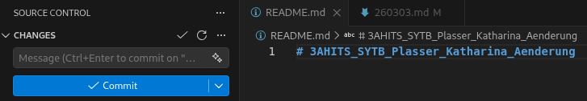

# Arbeitsbericht

- Name: Katharina Plasser
- Datum: 03.03.2026
- Thema: Arbeitsberichte über GitHub Pages
- Fach: SYTB
- Klasse: 3AHITS

# Download von Visual Studio Code
https://code.visualstudio.com/docs/setup/linux

# Änderung in README.md und Commit

<br>

Message in Commit eintragen und Button klicken. Jetzt erscheint die Änderung in GitHub.
# Verbinden von Kali Linux Shell mit GitHub
```bash
┌──(kali㉿kali)-[~]
└─$ cd SYTB
┌──(kali㉿kali)-[~/SYTB]
└─$ git clone https://github.com/KatharinaressalP/3AHITS_SYTB_Plasser_Katharina
Cloning into '3AHITS_SYTB_Plasser_Katharina'...
remote: Enumerating objects: 3, done.
remote: Counting objects: 100% (3/3), done.
remote: Total 3 (delta 0), reused 0 (delta 0), pack-reused 0 (from 0)
Receiving objects: 100% (3/3), done.
                                                                                  
┌──(kali㉿kali)-[~/SYTB]
└─$ ls
3AHITS_SYTB_Plasser_Katharina
                                                                                  
┌──(kali㉿kali)-[~/SYTB]
└─$ cd 3AHITS_SYTB_Plasser_Katharina 
                                                                                  
┌──(kali㉿kali)-[~/SYTB/3AHITS_SYTB_Plasser_Katharina]
└─$ code .
```
# Anglegen von User Name und User Email Adresse
```bash
┌──(kali㉿kali)-[~/SYTB/            3AHITS_SYTB_Plasser_Katharina]
└─$ git config --global user.name "Katharina.Plasser"

┌──(kali㉿kali)-[~/SYTB/        3AHITS_SYTB_Plasser_Katharina]
└─$ git config --global user.email Katharina.Plasser@htl-braunau.at
```
Wieder Message eingeben und Commit.