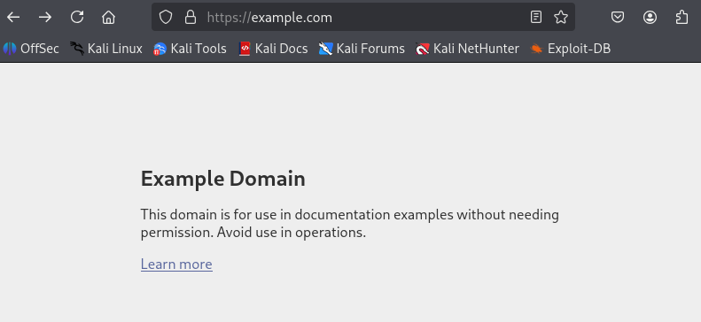

# Arbeitsbericht

- Name: Katharina Plasser
- Datum: 10.03.2026
- Thema: cURL
- Fach: SYTB
- Klasse: 3AHITS
- Angabe: https://www.franzmatejka.at/htl/doc/ITSI_2_linux/13_curl.html

## cURL
cURL ist ein Kommandozeilen-Tool zur Pbertragung von Daten zwischen einem Rechner und einem Server. Man kann damit z. B. Webseiten abrufen, APIs ansprechen, Dateien herunterladen oder HTTP-Header untersuchen. Es unterstützt zahlreiche Protokolle wie: HTTP/HTTPS, FTP, SMTP.

# Aufgaben:
## Rufe die Startseite von example.com mit curl ab. Du siehst den HTML Code der Seite im Terminal. Vergleiche dazu die Ansicht im Web-Browser.
Curl:
```bash
┌──(kali㉿kali)-[~]
└─$ curl https://example.com
<!doctype html><html lang="en"><head><title>Example Domain</title><meta name="viewport" content="width=device-width, initial-scale=1"><style>body{background:#eee;width:60vw;margin:15vh auto;font-family:system-ui,sans-serif}h1{font-size:1.5em}div{opacity:0.8}a:link,a:visited{color:#348}</style></head><body><div><h1>Example Domain</h1><p>This domain is for use in documentation examples without needing permission. Avoid use in operations.</p><p><a href="https://iana.org/domains/example">Learn more</a></p></div></body></html>
```
Web Browser: <br>

## Rufe dieselbe Seite wie in Aufgabe 1 auf, aber gib zusätzlich den HTTP-Response-Header aus. Hinweis: Es gibt dafür eine eigene curl-Option.
Du siehst dann sogenannte Meta-Informationen, das sind Informationen über die Web-Site (z.B.date, content-type) und den Server – die aber vom Browser nicht angezeigt werden.
```bash
┌──(kali㉿kali)-[~]
└─$ curl -i https://example.com        
HTTP/2 200 
date: Tue, 10 Mar 2026 07:22:39 GMT
content-type: text/html
cf-ray: 9da091cf587e1ef8-VIE
last-modified: Thu, 05 Mar 2026 11:54:13 GMT
allow: GET, HEAD
accept-ranges: bytes
age: 2732
cf-cache-status: HIT
server: cloudflare

<!doctype html><html lang="en"><head><title>Example Domain</title><meta name="viewport" content="width=device-width, initial-scale=1"><style>body{background:#eee;width:60vw;margin:15vh auto;font-family:system-ui,sans-serif}h1{font-size:1.5em}div{opacity:0.8}a:link,a:visited{color:#348}</style></head><body><div><h1>Example Domain</h1><p>This domain is for use in documentation examples without needing permission. Avoid use in operations.</p><p><a href="https://iana.org/domains/example">Learn more</a></p></div></body></html>
```
## Verbose Mode. Rufe eine beliebige URL auf und aktiviere den Verbose Mode, sodass Request, Response und Header sichtbar sind.
```bash
┌──(kali㉿kali)-[~]
└─$ curl -v https://example.com
* Host example.com:443 was resolved.
* IPv6: 2606:4700::6812:1b78, 2606:4700::6812:1a78
* IPv4: 104.18.27.120, 104.18.26.120
*   Trying [2606:4700::6812:1b78]:443...
* Immediate connect fail for 2606:4700::6812:1b78: Network is unreachable
*   Trying [2606:4700::6812:1a78]:443...
* Immediate connect fail for 2606:4700::6812:1a78: Network is unreachable
*   Trying 104.18.27.120:443...
* ALPN: curl offers h2,http/1.1
* TLSv1.3 (OUT), TLS handshake, Client hello (1):
*  CAfile: /etc/ssl/certs/ca-certificates.crt
*  CApath: /etc/ssl/certs
* TLSv1.3 (IN), TLS handshake, Server hello (2):
* TLSv1.3 (IN), TLS change cipher, Change cipher spec (1):
* TLSv1.3 (IN), TLS handshake, Encrypted Extensions (8):
* TLSv1.3 (IN), TLS handshake, Certificate (11):
* TLSv1.3 (IN), TLS handshake, CERT verify (15):
* TLSv1.3 (IN), TLS handshake, Finished (20):
* TLSv1.3 (OUT), TLS change cipher, Change cipher spec (1):
* TLSv1.3 (OUT), TLS handshake, Finished (20):
* SSL connection using TLSv1.3 / TLS_AES_256_GCM_SHA384 / X25519MLKEM768 / id-ecPublicKey
* ALPN: server accepted h2
* Server certificate:
*  subject: CN=example.com
*  start date: Feb 13 18:53:48 2026 GMT
*  expire date: May 14 18:57:50 2026 GMT
*  subjectAltName: host "example.com" matched cert's "example.com"
*  issuer: C=US; O=SSL Corporation; CN=Cloudflare TLS Issuing ECC CA 3
*  SSL certificate verify ok.
*   Certificate level 0: Public key type EC/prime256v1 (256/128 Bits/secBits), signed using ecdsa-with-SHA256
*   Certificate level 1: Public key type EC/prime256v1 (256/128 Bits/secBits), signed using ecdsa-with-SHA384
*   Certificate level 2: Public key type EC/secp384r1 (384/192 Bits/secBits), signed using sha256WithRSAEncryption
*   Certificate level 3: Public key type RSA (2048/112 Bits/secBits), signed using sha1WithRSAEncryption
* Connected to example.com (104.18.27.120) port 443
* using HTTP/2
* [HTTP/2] [1] OPENED stream for https://example.com/
* [HTTP/2] [1] [:method: GET]
* [HTTP/2] [1] [:scheme: https]
* [HTTP/2] [1] [:authority: example.com]
* [HTTP/2] [1] [:path: /]
* [HTTP/2] [1] [user-agent: curl/8.13.0]
* [HTTP/2] [1] [accept: */*]
> GET / HTTP/2
> Host: example.com
> User-Agent: curl/8.13.0
> Accept: */*
> 
* Request completely sent off
* TLSv1.3 (IN), TLS handshake, Newsession Ticket (4):
* TLSv1.3 (IN), TLS handshake, Newsession Ticket (4):
< HTTP/2 200 
< date: Tue, 10 Mar 2026 07:24:16 GMT
< content-type: text/html
< cf-ray: 9da0942bd8fc5abb-VIE
< last-modified: Thu, 05 Mar 2026 11:54:13 GMT
< allow: GET, HEAD
< accept-ranges: bytes
< age: 2829
< cf-cache-status: HIT
< server: cloudflare
< 
<!doctype html><html lang="en"><head><title>Example Domain</title><meta name="viewport" content="width=device-width, initial-scale=1"><style>body{background:#eee;width:60vw;margin:15vh auto;font-family:system-ui,sans-serif}h1{font-size:1.5em}div{opacity:0.8}a:link,a:visited{color:#348}</style></head><body><div><h1>Example Domain</h1><p>This domain is for use in documentation examples without needing permission. Avoid use in operations.</p><p><a href="https://iana.org/domains/example">Learn more</a></p></div></body></html>
* Connection #0 to host example.com left intact
```
## curl auf mit der Option aus der vorangegangenen Aufgabenstellung. Recherchiere Was bedeutet dieser http Status Code? Was zeigt ein Web-Browser bei dieser URL an?
```bash
* Request completely sent off
< HTTP/2 404 
< date: Tue, 10 Mar 2026 07:39:42 GMT
< content-type: text/html; charset=utf-8
< content-length: 0
< server: gunicorn/19.9.0
< access-control-allow-origin: *
< access-control-allow-credentials: true
```
Der Statuscode 404 bedeutet, dass der Server die Webseite nicht finden kann.

## Geschlechtsschätzung anhand von Namen. Lade https://api.genderize.io mit curl → du bekommst eine Fehlermeldung. Ein Parameter wird an die URL so angefügt: ?name=value. Ermittle das wahrscheinliche Geschlecht von: Noor, Ariel, Amina, Elowen, Levin. Hinweis: verwende Quotes ("<URL>") in der curl Kommandozeile, da ? in der shell eine spezielle Bedeutung hat.
Das Datenformat, das hier vom Server gesendet wird, ist JSON. Ganz viele Web-APIs verwenden JSON. Verwende die Option zum Anzeigen des Response-Headers und suche darin nach einem Hinweis auf dieses Datenformat.
```bash
┌──(kali㉿kali)-[~]
└─$ curl -i "https://api.genderize.io?name=Noor"
...
{"count":167923,"name":"Noor","gender":"female","probability":0.61}  

┌──(kali㉿kali)-[~]
└─$ curl -i "https://api.genderize.io?name=Ariel"
...
{"count":74669,"name":"Ariel","gender":"male","probability":0.83}  

┌──(kali㉿kali)-[~]
└─$ curl -i "https://api.genderize.io?name=Amina"
...
{"count":198519,"name":"Amina","gender":"female","probability":0.96}  

┌──(kali㉿kali)-[~]
└─$ curl -i "https://api.genderize.io?name=Elowen"
...
{"count":23,"name":"Elowen","gender":"female","probability":0.87}  

┌──(kali㉿kali)-[~]
└─$ curl -i "https://api.genderize.io?name=Levin" 
...
{"count":3186,"name":"Levin","gender":"male","probability":0.96}   
```
## In einer URL sind auch mehrere Parameter möglich – diese sind mit einem & getrennt:
?para1=value1&para2=value2.
Aufgabe: Unter dem API Endpoint https://api.open-meteo.com/v1/forecast gibt es Wetter Informationen. Die notwendigen Parameter sind latitude, longitude, und current_weather (Wetter-Beispiel). Verwende diese API um die aktuelle Wetterinformation für Braunau und für Funchal abzurufen.<br>
Braunau:
```bash
┌──(kali㉿kali)-[~]
└─$ curl "https://api.open-meteo.com/v1/forecast?latitude=48.258&longitude=13.035&current_weather=true" 
{"latitude":48.260002,"longitude":13.039999,"generationtime_ms":0.055789947509765625,"utc_offset_seconds":0,"timezone":"GMT","timezone_abbreviation":"GMT","elevation":360.0,"current_weather_units":{"time":"iso8601","interval":"seconds","temperature":"°C","windspeed":"km/h","winddirection":"°","is_day":"","weathercode":"wmo code"},"current_weather":{"time":"2026-03-10T07:45","interval":900,"temperature":1.5,"windspeed":1.0,"winddirection":225,"is_day":1,"weathercode":45}}  
```
Funchal:
```bash
┌──(kali㉿kali)-[~]
└─$ curl "https://api.open-meteo.com/v1/forecast?latitude=32.6669&longitude=-16.9241&current_weather=true"
{"latitude":32.6875,"longitude":-17.0,"generationtime_ms":0.1004934310913086,"utc_offset_seconds":0,"timezone":"GMT","timezone_abbreviation":"GMT","elevation":323.0,"current_weather_units":{"time":"iso8601","interval":"seconds","temperature":"°C","windspeed":"km/h","winddirection":"°","is_day":"","weathercode":"wmo code"},"current_weather":{"time":"2026-03-10T07:45","interval":900,"temperature":10.9,"windspeed":5.2,"winddirection":25,"is_day":1,"weathercode":3}}    
```
## JSON-Ausgaben sind kompakt und daher manchmal sehr schwer zu lesen. Pipe die Ausgabe von curl in das Tool jq, um zu formatieren.

```bash                     
┌──(kali㉿kali)-[~]
└─$ curl "https://api.open-meteo.com/v1/forecast?latitude=48.258&longitude=13.035&current_weather=true" | jq
  % Total    % Received % Xferd  Average Speed   Time    Time     Time  Current
                                 Dload  Upload   Total   Spent    Left  Speed
100   476    0   476    0     0   5346      0 --:--:-- --:--:-- --:--:--  5409
{
  "latitude": 48.260002,
  "longitude": 13.039999,
  "generationtime_ms": 0.11086463928222656,
  "utc_offset_seconds": 0,
  "timezone": "GMT",
  "timezone_abbreviation": "GMT",
  "elevation": 360.0,
  "current_weather_units": {
    "time": "iso8601",
    "interval": "seconds",
    "temperature": "°C",
    "windspeed": "km/h",
    "winddirection": "°",
    "is_day": "",
    "weathercode": "wmo code"
  },
  "current_weather": {
    "time": "2026-03-10T07:45",
    "interval": 900,
    "temperature": 1.5,
    "windspeed": 1.0,
    "winddirection": 225,
    "is_day": 1,
    "weathercode": 45
  }
}
```
## Um welche Stadt handelt es sich im Wetter-Beispiel? Verwende den API Endpoint https://api-bdc.io/data/reverse-geocode-client um das herauszufinden.
<br>

Braunau:
```bash
┌──(kali㉿kali)-[~]
└─$ curl "https://api-bdc.io/data/reverse-geocode-client?latitude=48.258&longitude=13.035" | jq 
  % Total    % Received % Xferd  Average Speed   Time    Time     Time  Current
                                 Dload  Upload   Total   Spent    Left  Speed
100  2275  100  2275    0     0  15593      0 --:--:-- --:--:-- --:--:-- 15689
{
  "latitude": 48.258,
  "lookupSource": "coordinates",
  "longitude": 13.035,
  "localityLanguageRequested": "en",
  "continent": "Europe",
  "continentCode": "EU",
  "countryName": "Austria",
  "countryCode": "AT",
  "principalSubdivision": "Oberosterreich",
  "principalSubdivisionCode": "AT-4",
  "city": "Braunau am Inn",
  "locality": "Braunau am Inn",
  "postcode": "",
  "plusCode": "8FWM725P+62",
  "localityInfo": {
    "administrative": [
      {
        "name": "Austria",
        "description": "country in Central Europe",
        "isoName": "Austria",
        "order": 4,
        "adminLevel": 2,
        "isoCode": "AT",
        "wikidataId": "Q40",
        "geonameId": 2782113
      },
      {
        "name": "Oberosterreich",
        "description": "federal state in the North of Austria",
        "isoName": "Oberosterreich",
        "order": 6,
        "adminLevel": 4,
        "isoCode": "AT-4",
        "wikidataId": "Q41967",
        "geonameId": 2769848
      },
      {
        "name": "Braunau District",
        "description": "district of Austria",
        "order": 9,
        "adminLevel": 6,
        "wikidataId": "Q255626",
        "geonameId": 2781519
      },
      {
        "name": "Braunau am Inn",
        "description": "town in Braunau District, Upper Austria, Austria",
        "order": 10,
        "adminLevel": 8,
        "wikidataId": "Q131128",
        "geonameId": 2781520
      }
    ],
    "informative": [
      {
        "name": "Europe",
        "description": "terrestrial continent located in north-western Eurasia",
        "isoName": "Europe",
        "order": 1,
        "isoCode": "EU",
        "wikidataId": "Q46",
        "geonameId": 6255148
      },
      {
        "name": "Europe/Berlin",
        "description": "time zone",
        "order": 2
      },
      {
        "name": "Europe/Vienna",
        "description": "time zone",
        "order": 3
      },
      {
        "name": "Western Austria",
        "order": 5,
        "wikidataId": "Q23241"
      },
      {
        "name": "Innviertel",
        "order": 7
      },
      {
        "name": "Innviertel",
        "description": "geographic region",
        "order": 8,
        "wikidataId": "Q700460",
        "geonameId": 2775213
      }
    ]
  }
}
```
Funchal:
```bash
┌──(kali㉿kali)-[~]
└─$ curl "https://api-bdc.io/data/reverse-geocode-client?latitude=32.6669&longitude=-16.9241" | jq
  % Total    % Received % Xferd  Average Speed   Time    Time     Time  Current
                                 Dload  Upload   Total   Spent    Left  Speed
100  2370  100  2370    0     0  25510      0 --:--:-- --:--:-- --:--:-- 25760
{
  "latitude": 32.6669,
  "lookupSource": "coordinates",
  "longitude": -16.9241,
  "localityLanguageRequested": "en",
  "continent": "Europe",
  "continentCode": "EU",
  "countryName": "Portugal",
  "countryCode": "PT",
  "principalSubdivision": "Madeira",
  "principalSubdivisionCode": "PT-30",
  "city": "Funchal",
  "locality": "Sao Roque",
  "postcode": "",
  "plusCode": "8C45M38G+Q9",
  "localityInfo": {
    "administrative": [
      {
        "name": "Portugal",
        "description": "country in Southwestern Europe",
        "isoName": "Portugal",
        "order": 3,
        "adminLevel": 2,
        "isoCode": "PT",
        "wikidataId": "Q45",
        "geonameId": 2264397
      },
      {
        "name": "Madeira",
        "description": "Autonomous Region of Portugal in the archipelago of Madeira",                                                                               
        "isoName": "Madeira",
        "order": 5,
        "adminLevel": 4,
        "isoCode": "PT-30",
        "wikidataId": "Q26253",
        "geonameId": 2593105
      },
      {
        "name": "Funchal",
        "description": "municipality in Madeira, Portugal",
        "order": 8,
        "adminLevel": 7,
        "wikidataId": "Q25444",
        "geonameId": 2267827
      },
      {
        "name": "Sao Roque",
        "description": "civil parish in Funchal",
        "order": 9,
        "adminLevel": 8,
        "wikidataId": "Q2652635",
        "geonameId": 2263228
      }
    ],
    "informative": [
      {
        "name": "Africa",
        "description": "continent",
        "isoName": "Africa",
        "order": 1,
        "isoCode": "AF",
        "wikidataId": "Q15",
        "geonameId": 6255146
      },
      {
        "name": "Europe",
        "description": "terrestrial continent located in north-western Eurasia",
        "isoName": "Europe",
        "order": 2,
        "isoCode": "EU",
        "wikidataId": "Q46",
        "geonameId": 6255148
      },
      {
        "name": "Atlantic/Madeira",
        "description": "time zone",
        "order": 4
      },
      {
        "name": "Madeira Island",
        "description": "island of Portugal",
        "order": 6,
        "wikidataId": "Q30188",
        "geonameId": 2266874
      },
      {
        "name": "Ilha da Madeira",
        "description": "statistical territorial entity of Portugal",
        "order": 7,
        "wikidataId": "Q14206035"
      }
    ]
  }
}
```
