# Arbeitsbericht

- Name: Katharina Plasser
- Datum: 09.06.2026
- Thema: Regular Expressions
- Fach: SYTB
- Klasse: 3AHITS
- [Angabe](https://www.franzmatejka.at/htl/doc/SYTB_3/20_regex_ue.html)

(Ich war die letzten zwei Mal nicht da, darum konnte ich erst heute mit Übung 1 beginnen)

## Übung (RegexONE)

Arbeite dich in RegexONE von Lesson 1 – 14.
<br>
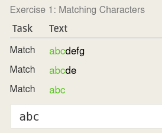
<details>
<summary>Mehr</summary>
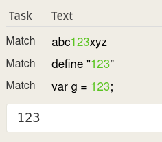

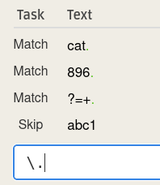

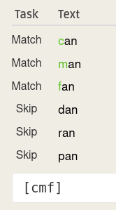

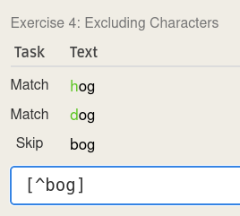

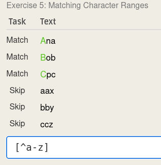

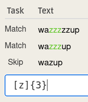

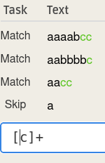

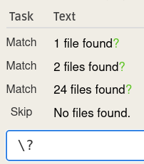

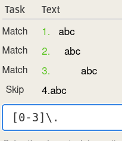

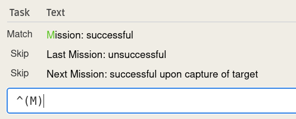

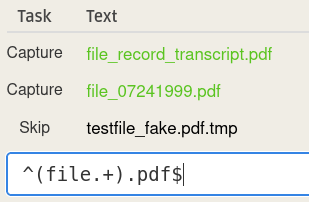

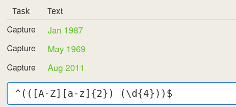

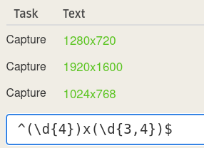

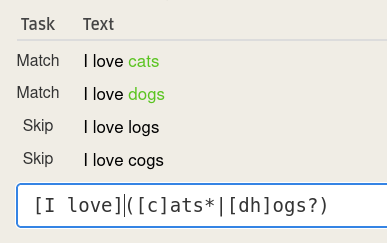
</details>

## Übung (Subdir Count)

Schreibe einen shell Einzeiler mit dem man die Anzahl der Unterverzeichnisse im aktuellen Verzeichnisse zählt.

Tipp: Directories haben in der ls -l Ausgabe ganz am Beginn ein d.

```bash
┌──(kali㉿kali)-[~]
└─$ ls -l | grep -c "^d"
11
```

## Übung (REs)

Finde 5 substantiell unterschiedliche Strings die durch folgende RE gematcht werden:

^[a-zA-Z0-9_.+-]+@[a-zA-Z0-9-]+\.[a-zA-Z0-9.-]+$

Verwende zum test grep.js.org

Achtung: ERE daher -E Option notwendig.
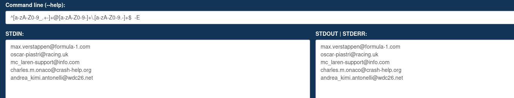

## Übung (sed)

Löse mit sed:

    Entferne alle # die sich am Ende der Zeile befinden
    Entferne alle # die sich am Anfang der Zeile befinden
    Füge === am Beginn jeder Zeile ein
    Füge () rund um jedes Wort ein. Ein Wort ist definiert als mindestens ein nicht-Leerzeichen.

datei.txt:
```bash
#Das ist die erste Zeilee#
#Hier steht noch ein Satz
Ein ganz normaler Text#
NurWorteOhneRauten
#
```

```bash
┌──(kali㉿kali)-[~]
└─$ sed 's/#$//' datei.txt
#Das ist die erste Zeilee
#Hier steht noch ein Satz
Ein ganz normaler Text
NurWorteOhneRauten
```
```bash
┌──(kali㉿kali)-[~]
└─$ sed 's/^#//' datei.txt
Das ist die erste Zeilee#
Hier steht noch ein Satz
Ein ganz normaler Text#
NurWorteOhneRauten
```

```bash
┌──(kali㉿kali)-[~]
└─$ sed 's/^/===/' datei.txt
===#Das ist die erste Zeilee#
===#Hier steht noch ein Satz
===Ein ganz normaler Text#
===NurWorteOhneRauten
===#
```

```bash

```